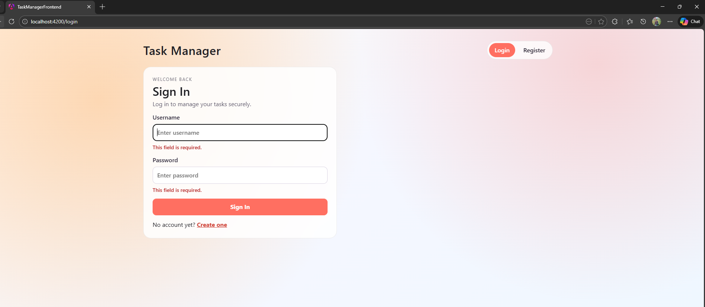
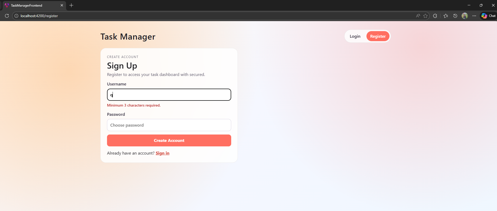
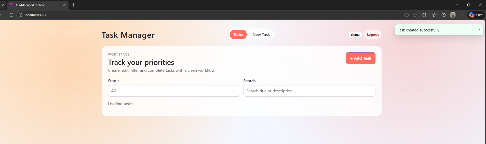
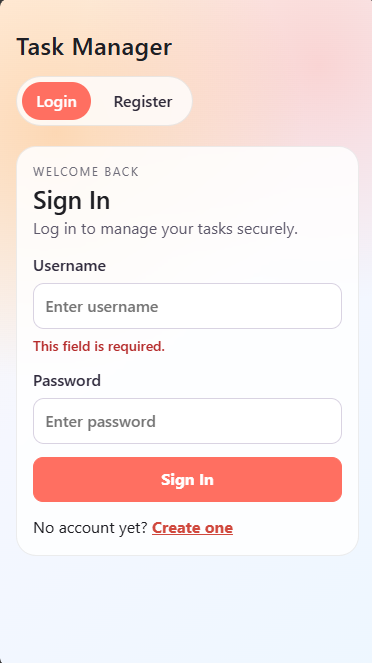

# Task Manager App

A modern full-stack task management system built with Angular and Spring Boot.  
It supports secure authentication, protected task operations, filtering, and Docker-based deployment.

## Tech Stack

- Frontend: Angular
- Backend: Spring Boot, Spring Security, Spring Data JPA
- Database: MySQL
- Auth: JWT (Bearer Token)
- Deployment: Docker Compose + Nginx

## Key Features

- User registration and login
- JWT-protected APIs
- Full CRUD for tasks
- Task status filtering (`TO_DO`, `IN_PROGRESS`, `DONE`)
- Input validation and global error handling
- Route guard and auth interceptor on frontend
- Responsive UI for daily use

## Project Layout

```text
.
|- backend/taskmanager              # Spring Boot API
|- frontend/task-manager-frontend  # Angular app
|- docker-compose.yml              # Full stack orchestration
```

## Quick Start

### Option 1: Run with Docker (Recommended)

From the project root:

1. Create a local environment file from the template.

```bash
cp .env.example .env
```

PowerShell:

```powershell
Copy-Item .env.example .env
```

2. Update `.env` with your local values:

- `MYSQL_ROOT_PASSWORD`
- `MYSQL_USER`
- `MYSQL_PASSWORD`
- `SPRING_DATASOURCE_USERNAME`
- `SPRING_DATASOURCE_PASSWORD`
- `APP_JWT_SECRET`

3. Start the stack:

```bash
docker compose up --build
```

Services:

- Frontend: http://localhost:4200
- Backend: http://localhost:8080
- MySQL: localhost:3308

Stop everything:

```bash
docker compose down
```

Reset containers and DB volume:

```bash
docker compose down -v
```

### Option 2: Run Locally

Prerequisites:

- Java 17+
- Node.js 20+ and npm
- MySQL 8+

Create database:

```sql
CREATE DATABASE taskdb;
```

Backend (PowerShell):

```powershell
cd backend/taskmanager
.\mvnw.cmd spring-boot:run
```

Frontend:

```bash
cd frontend/task-manager-frontend
npm install
npm start
```

## Configuration

Default database configuration:

- URL: `jdbc:mysql://localhost:3306/taskdb`
- Username: `taskapp_user` (example)
- Password: `change_me` (example)

Environment file usage:

- Keep real local values in `.env` (do not commit)
- Keep placeholders in `.env.example` (safe to commit)

You can override values with environment variables:

- `SPRING_DATASOURCE_URL`
- `SPRING_DATASOURCE_USERNAME`
- `SPRING_DATASOURCE_PASSWORD`
- `APP_JWT_SECRET`
- `APP_JWT_EXPIRATION_MS`
- `APP_CORS_ALLOWED_ORIGINS`

## API Overview

### Authentication

Base path: `/api/auth`

- `POST /api/auth/register`
- `POST /api/auth/login`

Sample request:

```json
{
  "username": "student1",
  "password": "secret123"
}
```

Sample response:

```json
{
  "token": "<jwt-token>",
  "tokenType": "Bearer",
  "expiresIn": 86400,
  "username": "student1"
}
```

Auth header for protected routes:

```http
Authorization: Bearer <jwt-token>
```

### Tasks (Protected)

Base path: `/api/tasks`

- `GET /api/tasks`
- `GET /api/tasks?status=TO_DO|IN_PROGRESS|DONE`
- `GET /api/tasks/{id}`
- `POST /api/tasks`
- `PUT /api/tasks/{id}`
- `DELETE /api/tasks/{id}`

Task payload:

```json
{
  "title": "Finish assignment",
  "description": "Implement full stack task manager",
  "status": "IN_PROGRESS"
}
```

## Screenshots

### Login


### Register


### Task List


### Create Task


### Update Task


### Notification


### Responsive View


## Notes

- Task endpoints require a valid JWT token.
- Register/login can be completed from the Angular UI.
